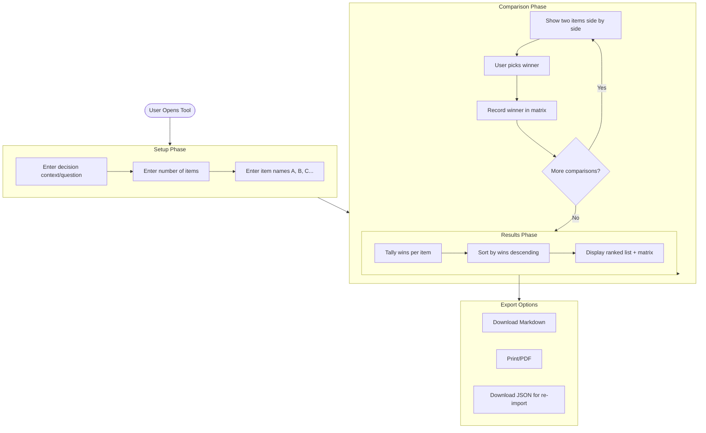
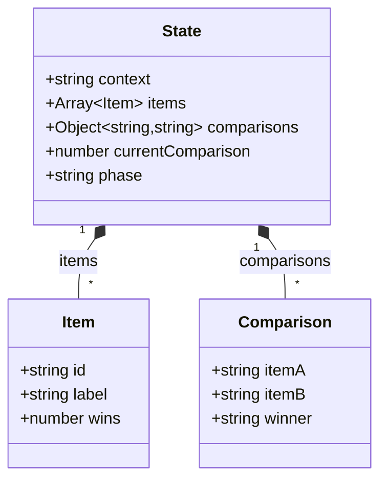
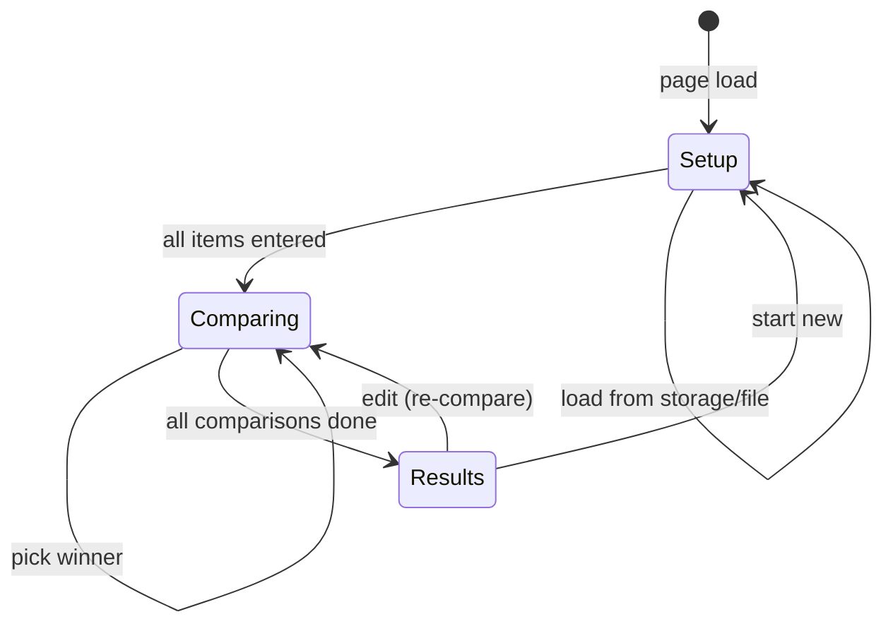
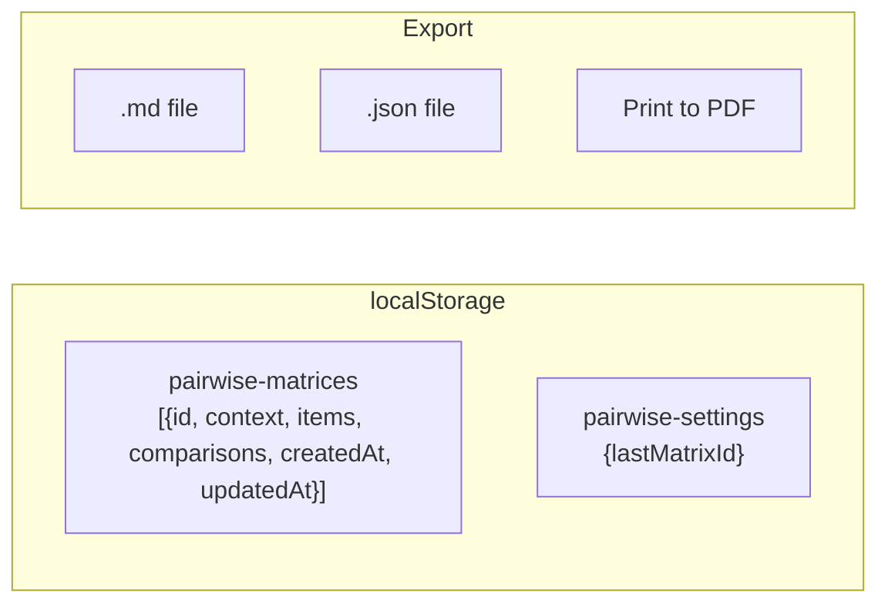

# Pairwise Matrix Architecture

## Overview

A pairwise comparison tool that helps users prioritize items by comparing them head-to-head. Each item competes against every other item exactly once, and the item with the most "wins" is ranked highest.

## How Pairwise Comparison Works

Given N items, there are N×(N-1)/2 unique comparisons:
- 3 items → 3 comparisons
- 4 items → 6 comparisons
- 5 items → 10 comparisons
- 6 items → 15 comparisons
- 10 items → 45 comparisons

## System Flow



## Data Model



## UI States



## Matrix Visualization

For items A, B, C, D, the matrix shows:

```
     A   B   C   D   Wins
A    -   ?   ?   ?
B    -   -   ?   ?
C    -   -   -   ?
D    -   -   -   -
```

- Diagonal is empty (no self-comparison)
- Upper triangle shows comparison results
- Lower triangle mirrors upper (if A beats B, then B loses to A)
- `?` indicates comparison not yet done
- Winner's letter fills the cell

## Storage



## Comparison Order

Comparisons are presented in a fixed order for consistency:
1. A vs B
2. A vs C
3. A vs D
4. B vs C
5. B vs D
6. C vs D

This ensures item A is compared against all others first, then B against remaining, etc.

## Keyboard Shortcuts

| Key | Action |
|-----|--------|
| 1 or ← | Pick left item |
| 2 or → | Pick right item |
| Backspace | Undo last comparison |
| Escape | Cancel/go back |
