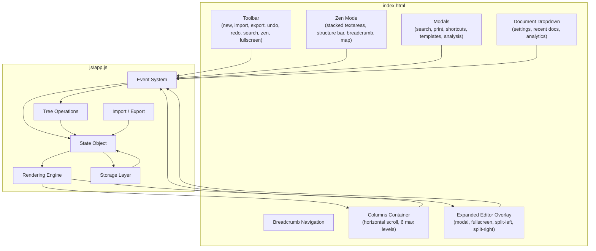
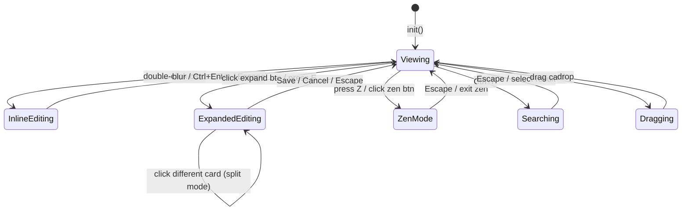
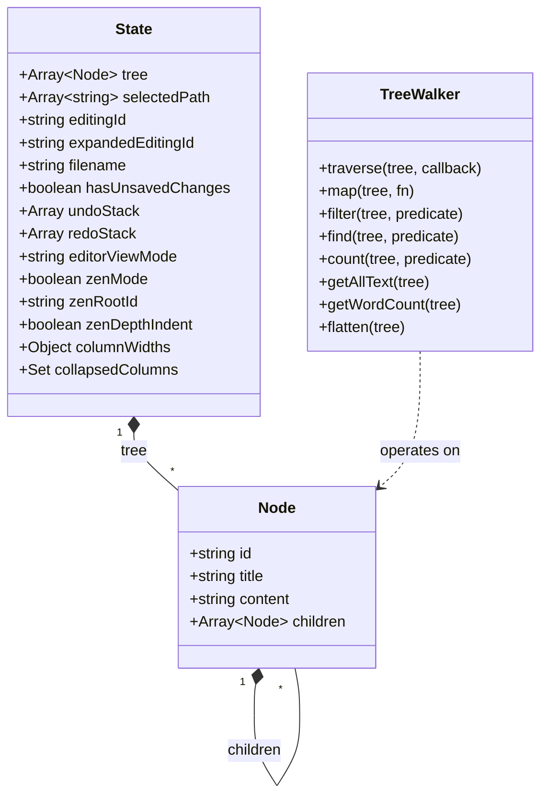
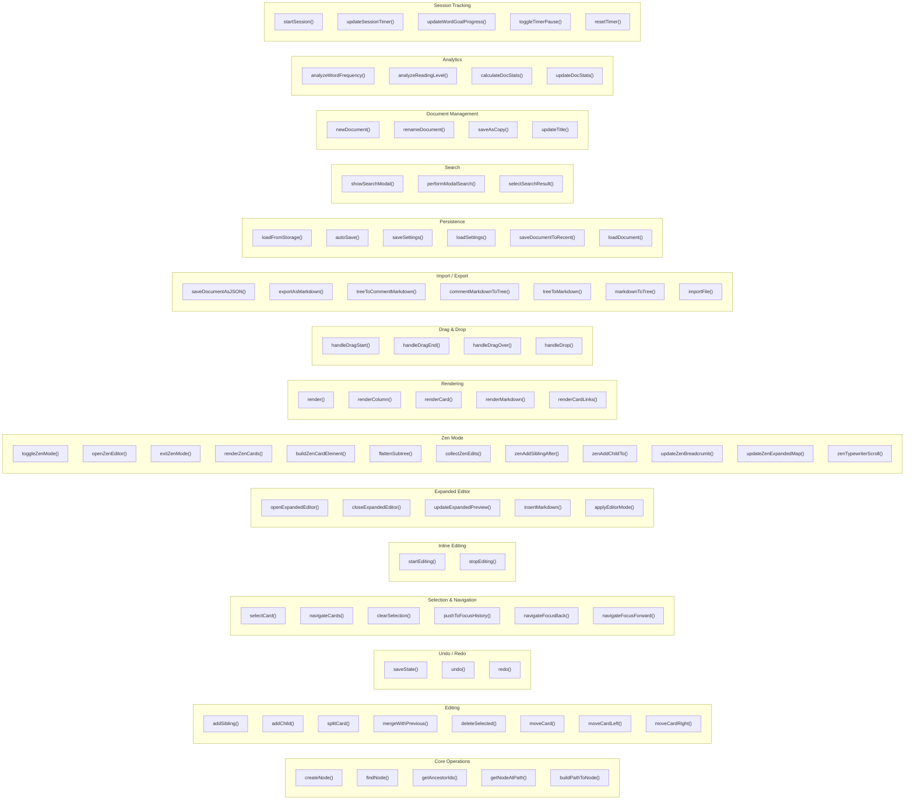
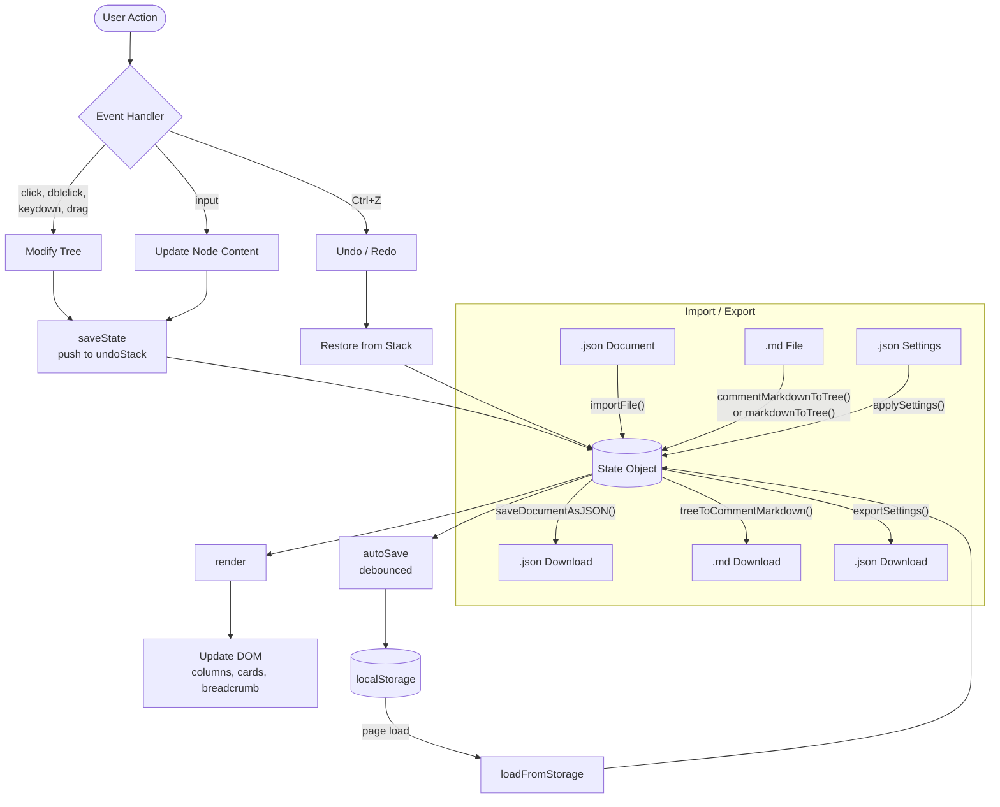
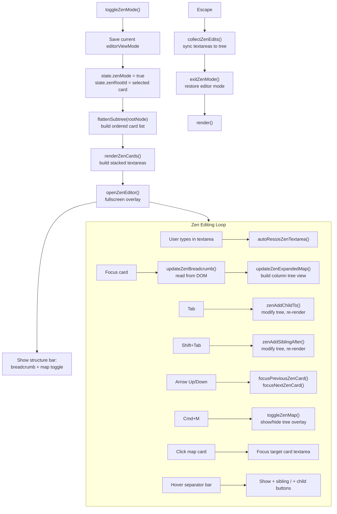
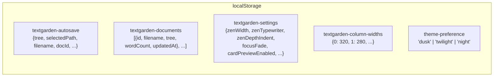
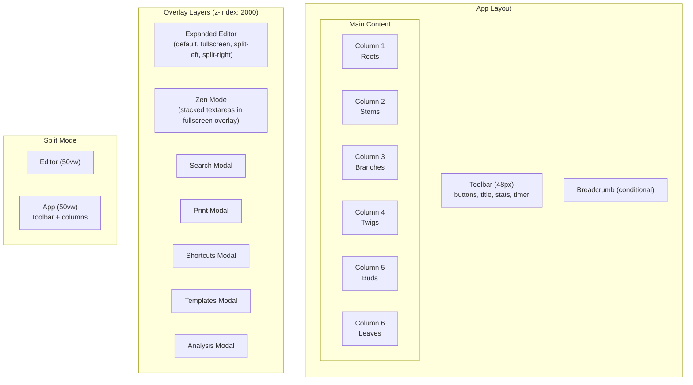
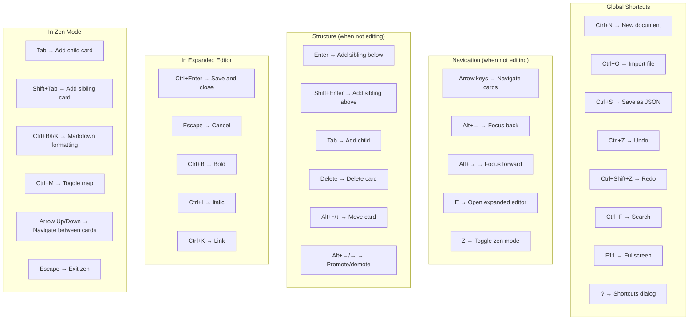

# TextGarden Architecture

## System Overview



## State Management



## Data Model



## Function Groups



## Data Flow



## Import / Export Formats

### JSON Document (primary, lossless)

```json
{
  "version": 1,
  "type": "textgarden-document",
  "filename": "My Document",
  "tree": [
    {
      "id": "uuid",
      "title": "Chapter 1",
      "content": "Body text with **markdown**.",
      "children": [...]
    }
  ],
  "selectedPath": ["uuid-1", "uuid-2"],
  "exportedAt": "2026-02-03T12:00:00.000Z"
}
```

### Markdown Export (comment-based structure)

```markdown
<!-- textgarden:node depth="1" title="Chapter 1" -->
Introduction text with **markdown**.

<!-- textgarden:node depth="2" title="Scene 1" -->
The scene opens...
```

Comments are invisible in rendered markdown (GitHub, VS Code preview, etc.). On import, files without comment markers fall back to heading-based parsing (`markdownToTree()`) for compatibility with generic markdown files.

## Zen Mode Flow



### Zen Mode UI Structure

Each card in zen mode is a `.zen-card` element containing:

1. **Separator bar** (`.zen-card-separator`): shows index (e.g., "1.2"), card title, and hover-reveal action buttons ("+ sibling", "+ child")
2. **Textarea** (`.zen-card-editor`): auto-resizing textarea for the card's content

Cards are indented by depth when the "Depth indentation" setting is enabled. The active card's separator is highlighted with the accent color.

### Zen Mode vs Old Architecture

The previous implementation serialized the subtree into a single textarea as markdown with HTML comment markers as card boundaries. The current implementation renders one textarea per card, eliminating the need for markdown serialization/parsing during editing. Tree modifications (add sibling/child) directly modify `state.tree` and re-render.

## Storage Layout



## UI Layout



## Keyboard Shortcuts


